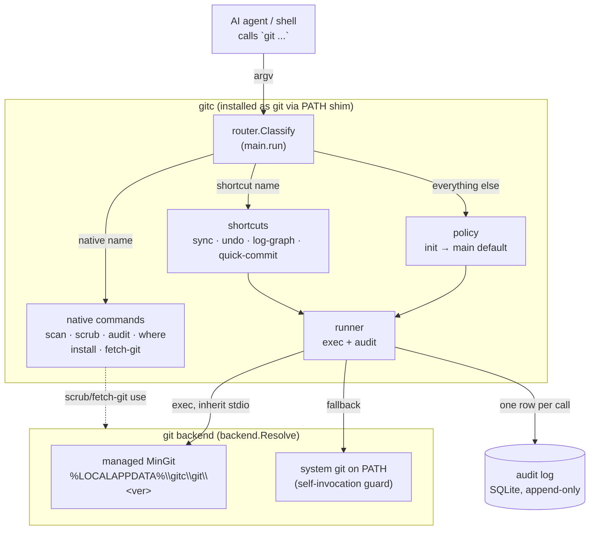
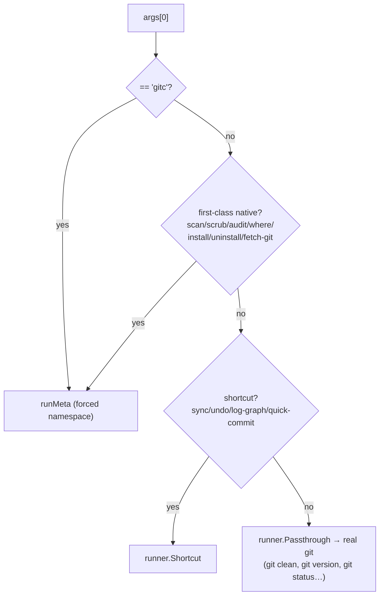
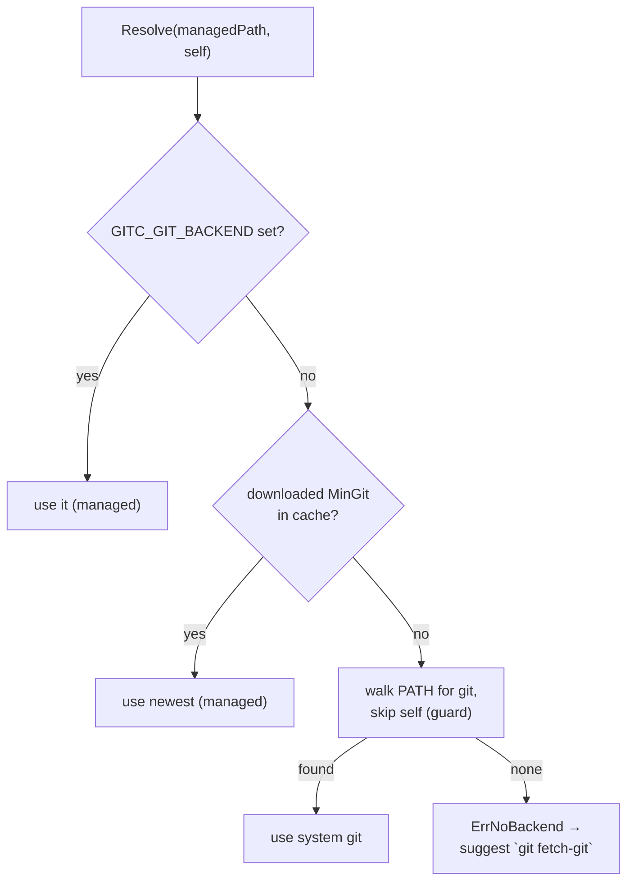
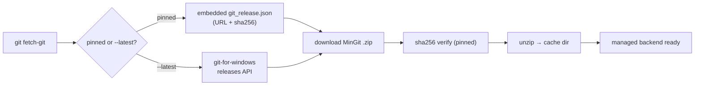

# Architecture
<!-- rev:001 -->

gitc is a transparent proxy that installs *as* `git` and routes every
invocation through a policy/audit chokepoint before delegating to a real git
backend. This document diagrams the real code in `main.go` + `internal/*`.

## System overview



## Command routing (`main.run` → `router.Classify`)

Only gitc-native names and the reserved `gitc` token are intercepted; names that
collide with real git (`clean`, `version`) pass through untouched.



## Passthrough + audit (per invocation)

```mermaid
sequenceDiagram
    participant A as agent
    participant R as runner
    participant B as backend (MinGit)
    participant S as store (SQLite)
    A->>R: git <args>
    R->>R: capture cwd, user, env subset, argv
    R->>B: exec CommandContext (inherit stdin/stdout/stderr)
    B-->>R: exit code + duration
    R->>B: enrich: `git status --porcelain=v2` (out-of-band)
    R->>S: INSERT audit row (raw, unredacted)
    Note over R,S: audit write is best-effort;<br/>never blocks the git command
    R-->>A: git's stdout/stderr + exit code
```

## Backend resolution (`backend.Resolve`)



## History scrub pipeline (`internal/filterrepo`)

Clean-room Go port of git-filter-repo's fast-export mechanism.

```mermaid
sequenceDiagram
    participant C as gitc gitc scrub
    participant E as git fast-export
    participant P as FastExportParser
    participant I as git fast-import
    C->>E: spawn (--show-original-ids …)
    E-->>P: fast-export stream
    loop each record
        P->>P: blobfilter (redact text) / pathfilter (drop paths) / commitfilter (prune)
        P->>I: re-serialized record
    end
    I-->>C: rewritten refs
    C->>C: reflog expire + gc (cleanup); sanity guard requires --force
```

## Git backend provisioning (`internal/gitwin`, ADR 0004)


